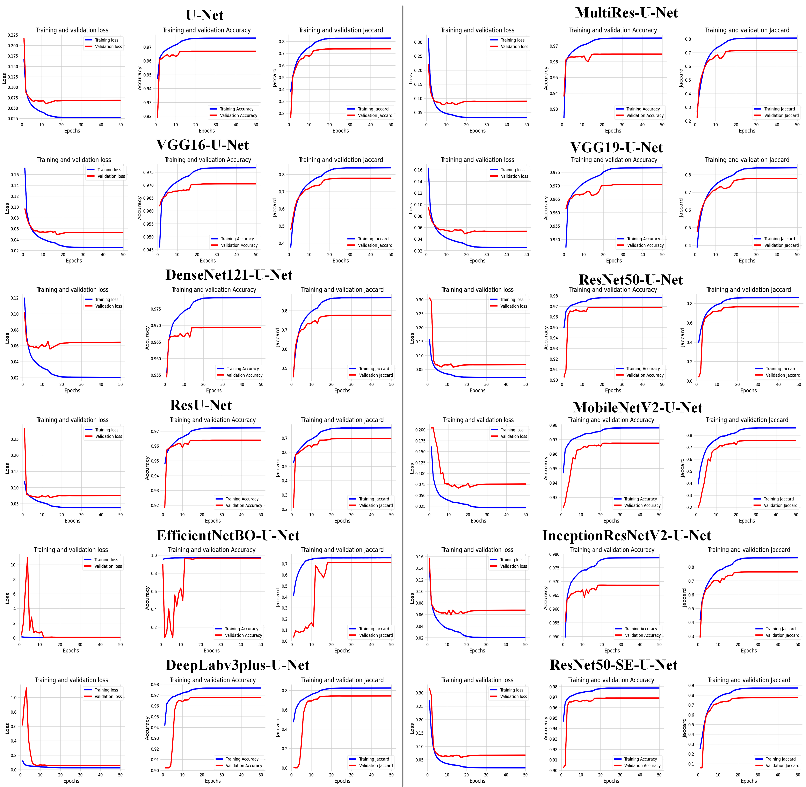
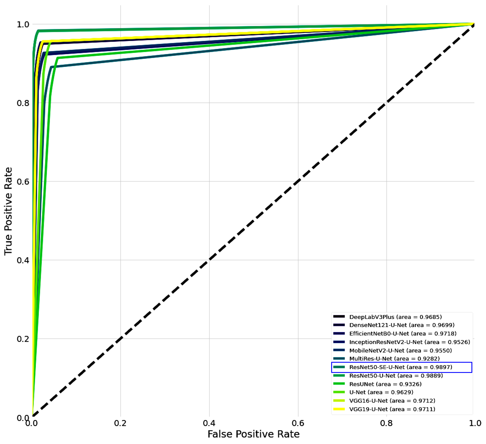

# ResNet50-SE-U-Net #

The code in this repository is supplementary to our future publication "A Hybrid Deep Learning Method Integrating ResNet50-SE-U-Net and Test Time Augmentation Techniques for Efficient Cell Segmentation" 

## Getting Started

These instructions will get you a copy of the project up and running on your local machine for development and testing purposes. 

## Prerequisites
* [Anaconda Distribution](https://www.anaconda.com/products/individual)
* A CUDA capable GPU
* Minimum / recommended RAM: 16 GiB / 32 GiB
* Minimum / recommended VRAM: 12 GiB / 24 GiB
* This project is writen in Python 3 and makes use of tensorflow. 

## Model
<p align="center">

</p>


## Installation
In order to get the code, either clone the project, or download a zip file from GitHub.

Clone the Cell segmentation repository:
```
https://github.com/jovialniyo93/ResNet50-SE-U-Net
```
Open the Anaconda Prompt (Windows) or the Terminal (Linux), go to the ResNet50-SE-U-Net repository and create a new virtual environment:
```
cd path_to_the_cloned_repository
```

## Dataset

**The Dataset is available in the link below :**

[To download Dataset and all procedures for data preparation you can use this link:] [Click Here](https://github.com/jovialniyo93/cell-detection-and-tracking)	

# How to train and test our model

To train the model run the script```python train.py```.

To test the model run the script```python test.py```.
<br/>

**To run the scripts, You can alternatively use Google Colaboratory:**

## Hyperparameters:
 
 <ol>
  <li>Batch size = 16</li> 
  <li>Number of epoch = 100</li>
  <li>Loss = Binary crossentropy</li>
  <li>Optimizer = Adam</li>
  <li>Dropout_rate =  0.05</li>
  <li>Learning Rate = 1e-4 (Adjusted for some experiments)</li>
</ol>

## Evaluation and metrics

**We use the following evaluation Metrics for experimental results:**

Accuracy, Jaccard, Dice, Precision, and Recall

## Results

Training and validation loss curves<br/>
<p align="center">

</p> 

Quantitative result comparison of the proposed models on iPS dataset<br/>
<p align="center">

</p>

Qualitative result comparison of the models trained and tested on iPS <br/>
<p align="center">

</p>

ROC curve of the model trained on iPS dataset
<p align="center">

</p>

# Project Collaborators and Contact

**Created by:** Ph.D. student: Jovial Niyogisubizo 
Department of Computer Applied Technology,  
Center for High Performance Computing, Shenzhen Institute of Advanced Technology, CAS. 

For more information, contact me or:

* **Prof Yanjie Wei**  
Shenzhen Institute of Advanced Technology, CAS 
Address: 1068 Xueyuan Blvd., Shenzhen, Guangdong, China
Postcode: 518055
yj.wei@siat.ac.cn


* **Jovial Niyogisubizo**  
Shenzhen Institute of Advanced Tech., CAS 
Address: 1068 Xueyuan Blvd., Shenzhen, Guangdong, China
Postcode: 518055
jovialniyo93@gmail.com

## License ##
This project is licensed under the MIT License - see the [LICENSE.md](LICENSE.md) file for details.
